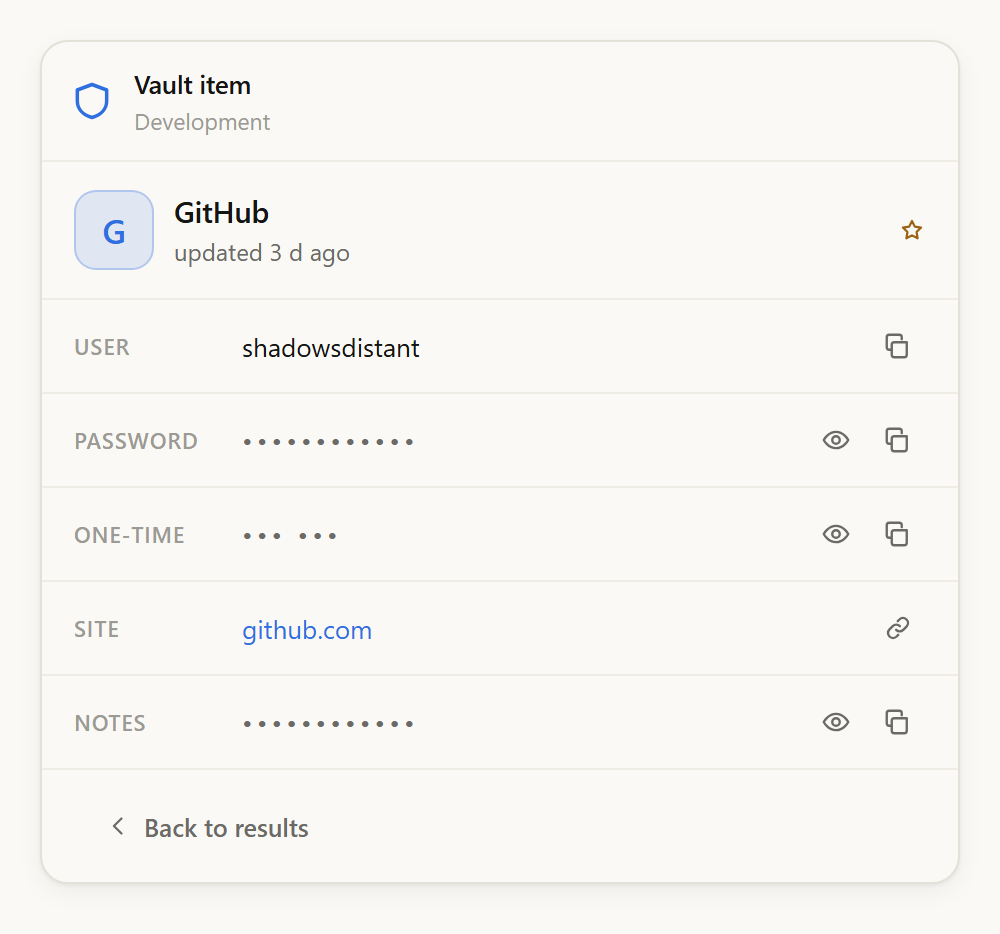
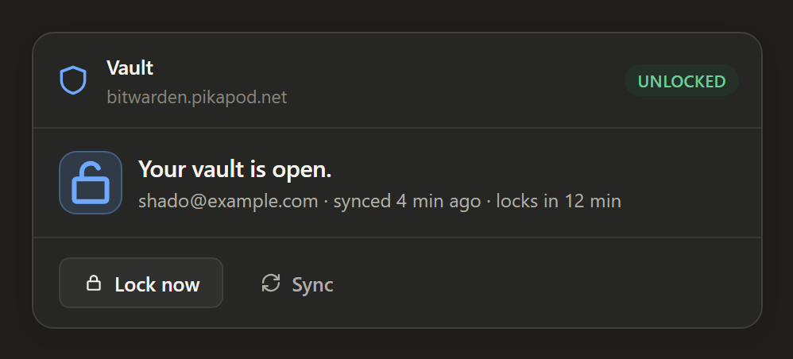
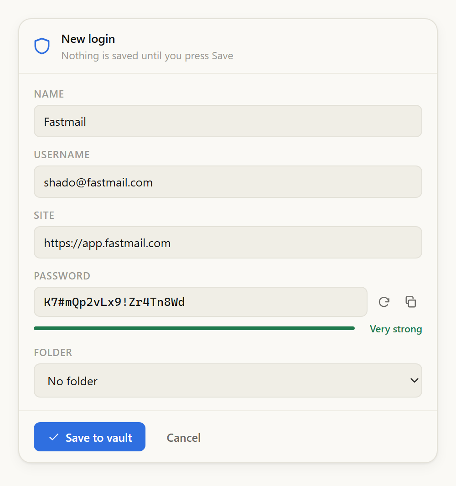
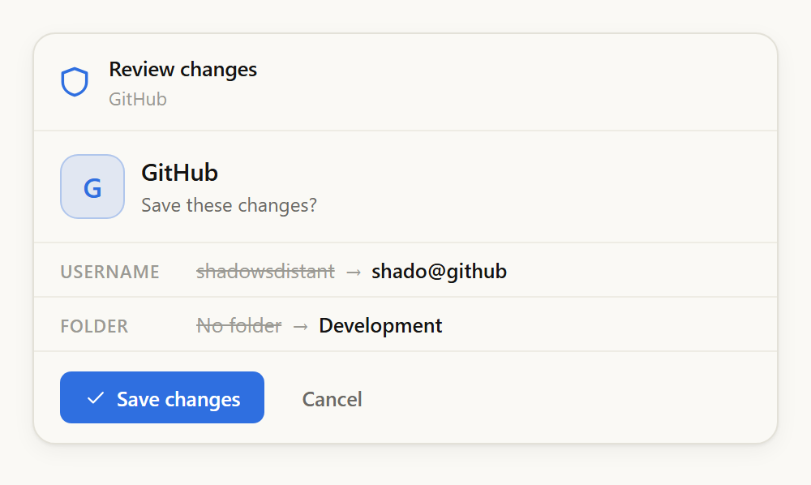
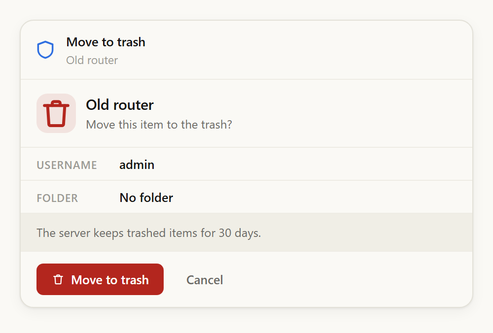

# Vaultwarden MCP

Connects Claude to your self-hosted [Vaultwarden](https://github.com/dani-garcia/vaultwarden) vault
through the official [Bitwarden CLI](https://bitwarden.com/help/cli/).

Ask for a login and you get a card beside the reply, with the password behind a dotted row and a
copy button. Ask for a new one and you get a filled-in draft with a generated password, which
saves when you press Save and not before. Claude can search your vault, read what is in it, and
propose changes — but it never receives a password, and it cannot change anything on its own.

<p align="center">
  
  
</p>

> **Not affiliated with Bitwarden or Vaultwarden.** This is a personal project that drives the
> published Bitwarden CLI. Read [SECURITY.md](SECURITY.md) before pointing it at a vault you care
> about, and decide for yourself.

## What Claude can and cannot do

|                                                    |                                                                                        |
| -------------------------------------------------- | -------------------------------------------------------------------------------------- |
| Search your vault, list folders                     | Yes                                                                                      |
| See item names, usernames, which site they are for  | Yes                                                                                      |
| See whether an item has a password, code, or notes  | Yes                                                                                      |
| **Read a password, one-time code, or note**         | Only after you say yes in a window on your desktop, once per request                     |
| **Create, edit, or trash an item**                  | Only after you press Save or Confirm in the card                                          |
| Delete something permanently                        | No. Deletes move an item to the trash, where your server keeps it for 30 days             |
| Change which vault server is used                   | No. That is set when you install this, and cannot be reached from a conversation          |
| See your master password                            | No. It is typed into a desktop window and handed straight to the CLI                      |

The reasoning behind each of these is in [SECURITY.md](SECURITY.md).

## The card

Everything sensitive happens in the card rather than the conversation. It follows Claude's own
light and dark themes.

<p align="center">
  
  
  
</p>

**Reveal** shows a secret for thirty seconds, then hides it again. **Copy** never displays the
value at all: the server writes it straight to your clipboard and clears it thirty seconds later,
tagged so Windows clipboard history and cloud clipboard skip it. Items you marked "master password
re-prompt" ask for your password again before either.

## Requirements

- **Node 20 or newer.** The Bitwarden CLI ships inside this package; nothing else to install.
- **A Vaultwarden or Bitwarden account.** Vaultwarden 1.37.2 or newer, for the CLI version bundled here.
- **A desktop session.** Signing in, unlocking, and approving a reveal all use a real OS window.
  Windows and macOS are supported; on Linux you need `zenity` or `kdialog`. Without one, unlock the
  vault yourself and start the server with `BW_SESSION` set.

## Install

### From a release (recommended)

Download `vaultwarden-mcp-<version>.mcpb` from
[Releases](https://github.com/ShadowsDistant/Vaultwarden-MCP/releases/latest) and open it. Claude
Desktop installs it as an extension and asks for your vault address; the rest is optional.

### From source

```bash
git clone https://github.com/ShadowsDistant/Vaultwarden-MCP.git
cd Vaultwarden-MCP
npm install --legacy-peer-deps
npm run build
node scripts/install.mjs --server https://vault.example.com --email you@example.com
```

On Windows, `scripts\setup.ps1` does the same but builds outside OneDrive, which matters if the
repository lives in a synced folder:

```powershell
.\scripts\setup.ps1 -Install -Server https://vault.example.com -Email you@example.com
```

Then fully quit and relaunch Claude Desktop.

### Signing in

Ask Claude to sign in to your vault. A window opens on your desktop for your email, master
password, and two-step code if you use one. Claude never sees any of it — the window belongs to
this server, and what you type goes down a pipe to the Bitwarden CLI.

If a window ever asks for your master password **inside the chat**, something is wrong. This
server never does that.

## Settings

Set through the extension's settings in Claude Desktop, or as environment variables in
`claude_desktop_config.json`.

| Variable                | Default              | What it does                                                                    |
| ----------------------- | -------------------- | ------------------------------------------------------------------------------- |
| `VW_MCP_SERVER_URL`     | —                    | Your vault address. Required, and deliberately not settable from a conversation. |
| `VW_MCP_EMAIL`          | —                    | Pre-fills the sign-in window.                                                    |
| `VW_MCP_IDLE_LOCK_MIN`  | `15`                 | Lock the vault after this many idle minutes. `0` never locks automatically.      |
| `VW_MCP_MODEL_REVEAL`   | `ask`                | `ask` allows a reveal after you approve it in a window; `off` refuses outright.  |
| `VW_MCP_HOME`           | `~/.vaultwarden-mcp` | Where the vault cache, config, and log live.                                     |
| `VW_MCP_CA_FILE`        | —                    | A CA bundle, if your instance uses a private certificate authority.              |
| `VW_MCP_ALLOW_HTTP`     | unset                | Permit a plain-http address for a host other than localhost.                     |
| `VW_MCP_REVEAL_SECONDS` | `30`                 | How long a revealed secret stays on screen.                                      |
| `VW_MCP_CLIPBOARD_CLEAR_SECONDS` | `30`        | How long a copied secret stays on the clipboard.                                 |
| `BW_SESSION`            | unset                | An already-unlocked session, for a machine with no desktop.                      |

## Tools

⧉ marks the tools that draw a card.

| Tool                       | What it does                                                                              |
| -------------------------- | ----------------------------------------------------------------------------------------- |
| `vault_status` ⧉           | Whether the vault is signed in, locked, or unlocked, and which instance it points at        |
| `vault_login` ⧉            | Sign in. Opens a window on your desktop                                                     |
| `vault_unlock` ⧉           | Unlock. Opens a window on your desktop                                                      |
| `vault_lock`               | Lock immediately and forget the session key                                                 |
| `vault_sync`               | Pull the latest vault contents from the server                                              |
| `vault_search` ⧉           | Find items by name, site, or folder. Names and hosts only — no usernames in bulk            |
| `vault_get_item` ⧉         | One item in full, minus every secret                                                        |
| `vault_list_folders`       | The folders, with the ids used to file or filter                                            |
| `vault_generate_password` ⧉| Generate a password or passphrase. The value goes to the card, not the conversation         |
| `vault_create_login` ⧉     | Prepare a new login for you to save                                                         |
| `vault_edit_item` ⧉        | Prepare a change for you to confirm, shown as a before-and-after                            |
| `vault_trash_item` ⧉       | Prepare to move an item to the trash, for you to confirm                                    |
| `vault_restore_item` ⧉     | Bring an item back out of the trash                                                         |
| `vault_reveal_secret`      | Ask you, in a desktop window, to release one secret into the conversation                   |

A second set of tools exists for the card alone — reading a secret on a click, copying to the
clipboard, saving a draft. They are marked app-only, and they stay switched off entirely unless
the connected client says at startup that it supports MCP Apps. On any other host they do not
exist, so nothing can call them.

## Development

```bash
npm install --legacy-peer-deps
npm run build          # tsc, then bundle the card into one HTML file
npm test               # 64 tests against a fake Bitwarden CLI, over real stdio
npm run preview        # the card's views at http://localhost:8766
```

The tests never touch a real vault. `test/fake-bw/bw.js` emulates the CLI, matching its
`--response` envelopes and reproducing two of its shipped bugs, and the whole server runs as a
child process driven by the MCP SDK client. The important one asserts that a sentinel string
planted in every secret never appears anywhere in a model-visible result.

`npm run pack` builds the `.mcpb` extension bundle.

### Layout

```
src/index.ts      server bootstrap, instructions, shutdown
src/config.ts     settings, paths, URL validation
src/bw.ts         the CLI wrapper: re-entrant lock, minimal environment, response parsing
src/session.ts    the session key, sign-in, unlock, idle lock
src/vault.ts      item operations, and the model-facing and card-facing projections
src/sanitize.ts   the untrusted-text screen and the result envelope
src/pending.ts    staged changes: unguessable ids, single use, ten-minute lifetime
src/prompt.ts     native dialogs
src/clipboard.ts  copy, and the clear that only fires if the value is still there
src/tools.ts      the tool surface
ui/card.html      the card's markup and theme
ui/card.ts        the card
scripts/          build, install, package, dialogs, clipboard helpers
test/             unit tests, end-to-end tests, the fake CLI and dialog
```

## Troubleshooting

**"The Bitwarden CLI is not installed."** The bundled CLI did not survive the install. Re-run
`npm install --legacy-peer-deps` and `npm run build`, or reinstall the extension.

**No window appears when signing in.** On Linux, install `zenity` or `kdialog`. Anywhere else,
check the log at `~/.vaultwarden-mcp/logs/server.log`. As a fallback, run `bw unlock --raw`
yourself and pass the result as `BW_SESSION`.

**"Could not reach the vault server."** Check the address in your settings, and that the instance
is up. If it uses a private certificate authority, point `VW_MCP_CA_FILE` at the bundle.

**Claude says an item was created but it is not there.** It was a draft. Nothing is written until
you press Save in the card. If the card did not appear, your host does not support MCP Apps.

**The vault keeps locking.** Raise `VW_MCP_IDLE_LOCK_MIN`, or set it to `0`.

## Licence

MIT. See [LICENSE](LICENSE).
